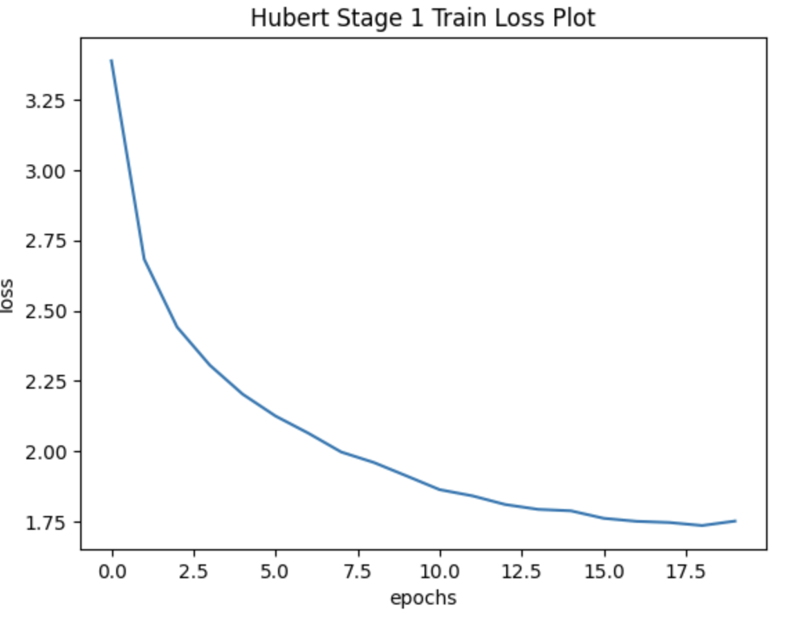
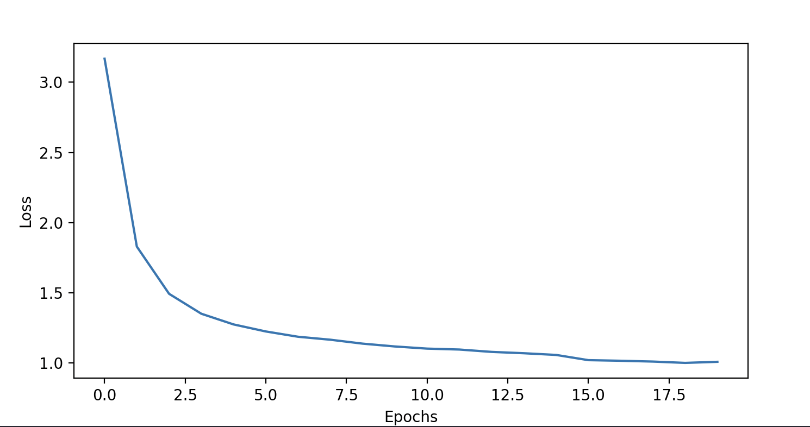
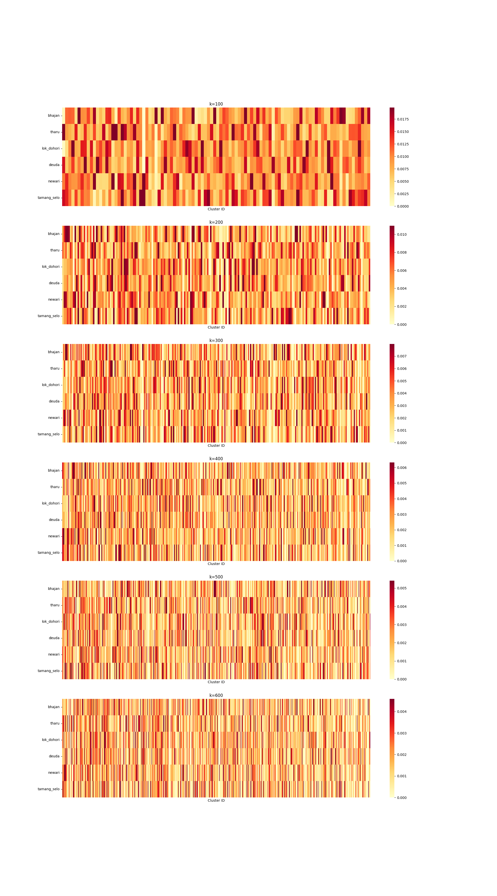
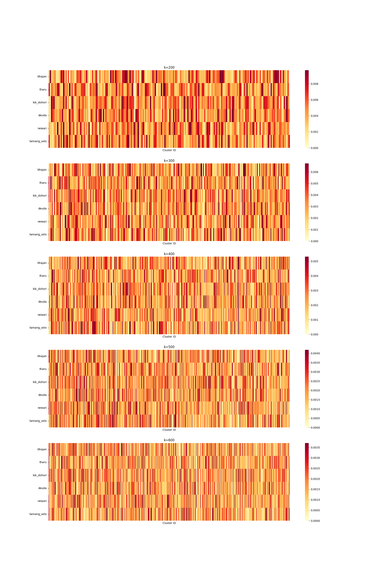

# Fine-tuning HuBERT Base on Nepali Folk Songs

This repository contains a fine-tuned HuBERT-base model with 98M parameters, trained on a custom Nepali folk song dataset with a total duration of 29.4 hours.

## Overview

- Model: HuBERT-base
- Parameters: 98M
- Dataset: Custom Nepali folk songs
- Total audio duration: 29.4 hours
- Goal: Adapt the pretrained HuBERT model to Nepali folk song audio using the self-supervised training procedure described in the original HuBERT paper.

## Training Approach

The model was fine-tuned in two stages, following the original HuBERT methodology:

### Stage 1
- Feature representation: MFCC
- Pseudo-label generation: k-means clustering
- Number of clusters: 100

### Stage 2
- Feature representation: learned representations from the previous stage
- Pseudo-label generation: k-means clustering
- Number of clusters: 200

## Training Loss Plots

The loss curves for both training stages are included below:

- Stage 1 loss: 
- Stage 2 loss: 

## Clustering Heatmaps

The clustering behavior for both stages is visualized below using heatmaps:

### Stage 1 Heatmap

### Stage 2 Heatmap

From the heatmaps, Stage 2 appears to be better than Stage 1. The Stage 2 heatmap shows a more organized and clearer clustering structure, with stronger and more consistent patterns across clusters, suggesting improved representation quality and better grouping of the learned features compared to Stage 1.

## Downstream Genre Classification

To evaluate the usefulness of the learned representations, downstream genre classification was performed using XGBoost on features extracted from:

- the original HuBERT model
- the Stage 2 fine-tuned HuBERT model

### Results Summary

| Model | Accuracy | Macro F1 | Notes |
| --- | ---: | ---: | --- |
| Original HuBERT | 0.78 | 0.77 | Baseline performance |
| Stage 2 HuBERT | 0.90 | 0.90 | Better performance after fine-tuning |

The Stage 2 HuBERT model clearly outperformed the original HuBERT model in genre classification, indicating that the fine-tuning process improved the quality of the learned representations for downstream musical genre recognition.

### Result Files

- Original HuBERT results: [results/XGBModel_hubert_original](results/XGBModel_hubert_original)
- Stage 2 HuBERT results: [results-2/XGBModel_Hubert_stage_2](results-2/XGBModel_Hubert_stage_2)

### Weights:
- The weights of the model are availabe in 
    - [stage-1-weights](stage-1-weights)
    - [stage-2-weights](stage-2-weights)

## Project Files

- [hubert-stage-1.ipynb](hubert-stage-1.ipynb) — Notebook for Stage 1 training
- [hubert-stage-2-final.xpynb](hubert-stage-2-final.xpynb) — Notebook for Stage 2 training
- [hubert-train-from-epoch-15.ipynb](hubert-train-from-epoch-15.ipynb) — Continued training from epoch 15

## Notes

This project is intended for reproducibility, experimentation, and further development of speech representation learning for Nepali folk song audio.
